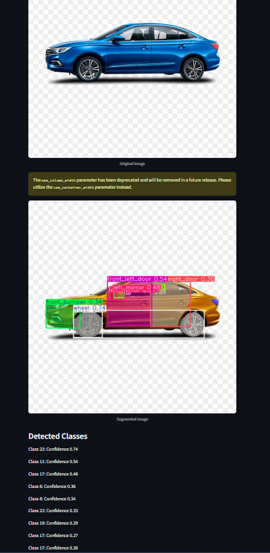

# Car Wrap Project 🚗

## 🖼️ Showcase

Below is a screenshot of the Car Wrap app in action:



A machine learning-powered web application for car parts segmentation and analysis, designed to assist in car wrap design and planning.

## 📋 Overview

This project uses YOLO (You Only Look Once) object detection to segment different parts of a car from uploaded images. The application provides real-time car parts segmentation, making it useful for:

- Car wrap design planning
- Vehicle analysis
- Automotive research
- Custom vehicle modifications

## 🚀 Features

- **Real-time Car Parts Segmentation**: Upload car images and get instant segmentation results
- **Web-based Interface**: User-friendly Streamlit web application
- **YOLO Model Integration**: Uses fine-tuned YOLO model for accurate car part detection
- **Multiple Image Formats**: Supports JPG, JPEG, and PNG image uploads
- **Confidence Scoring**: Displays detection confidence for each identified part

## 🛠️ Installation

### Prerequisites

- Python 3.8 or higher
- pip package manager

### Setup Instructions

1. **Clone the repository**
   ```bash
   git clone <your-repository-url>
   cd Car-Parts-Seg-22-class
   ```

2. **Create and activate virtual environment**
   ```bash
   # Create virtual environment
   python -m venv venv
   
   # Activate virtual environment
   # On Windows:
   venv\Scripts\activate
   # On macOS/Linux:
   source venv/bin/activate
   ```

3. **Install required dependencies**
   ```bash
   pip install streamlit pillow numpy opencv-python ultralytics
   ```

## 📁 Project Structure

```
Car Wrap2/
├── app.py              # Main Streamlit application
├── best.pt             # Fine-tuned YOLO model (17MB)
├── venv/               # Virtual environment
├── README.md           # Project documentation
└── .git/               # Git repository
```

## 🎯 Usage

1. **Start the application**
   ```bash
   streamlit run app.py
   ```

2. **Access the web interface**
   - Open your browser and navigate to `http://localhost:8501`
   - The application will automatically open in your default browser

3. **Upload and analyze images**
   - Click "Browse files" to upload a car image
   - Supported formats: JPG, JPEG, PNG
   - View the original image and segmented results
   - Check confidence scores for detected parts

## 🔧 Technical Details

### Model Information
- **Model Type**: YOLO (You Only Look Once)
- **Model File**: `best.pt` (17MB)
- **Framework**: Ultralytics YOLO
- **Purpose**: Car parts segmentation

### Dependencies
- `streamlit`: Web application framework
- `PIL (Pillow)`: Image processing
- `numpy`: Numerical computing
- `opencv-python`: Computer vision operations
- `ultralytics`: YOLO model framework

### Key Functions
- `load_model()`: Loads and caches the YOLO model
- Image preprocessing and conversion
- Real-time prediction and visualization
- Confidence score display

## 🎨 Features in Detail

### Image Upload
- Drag and drop or click to upload
- Automatic format validation
- Real-time preview

### Segmentation Results
- Overlaid masks on original image
- Color-coded part identification
- High-resolution output

### Confidence Metrics
- Per-class confidence scores
- Detection reliability indicators
- Quality assessment

## 🔮 Future Enhancements

- [ ] Support for video uploads
- [ ] Batch processing capabilities
- [ ] Export functionality for segmented images
- [ ] Integration with car wrap design software
- [ ] Mobile-responsive interface
- [ ] Additional car models and parts

## 🤝 Contributing

1. Fork the repository
2. Create a feature branch (`git checkout -b feature/AmazingFeature`)
3. Commit your changes (`git commit -m 'Add some AmazingFeature'`)
4. Push to the branch (`git push origin feature/AmazingFeature`)
5. Open a Pull Request

## 📝 License

This project is licensed under the MIT License - see the [LICENSE](LICENSE) file for details.

## 🙏 Acknowledgments

- YOLO model architecture by Joseph Redmon
- Ultralytics for the YOLO implementation
- Streamlit for the web framework
- OpenCV community for computer vision tools

## 📞 Support

For support and questions:
- Create an issue in the repository
- Contact the development team
- Check the documentation

---

**Note**: This project is designed for educational and research purposes. Always ensure you have proper permissions when using images of vehicles. 
